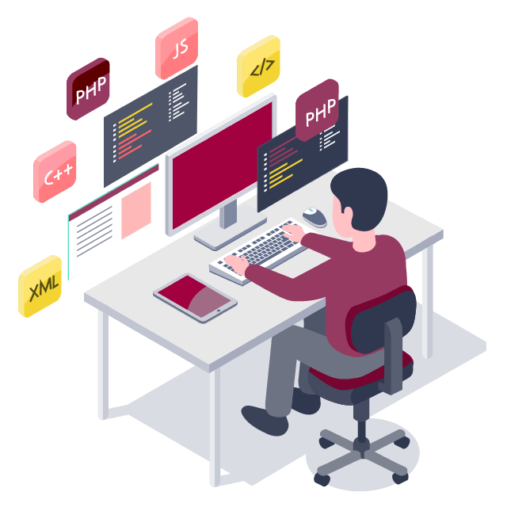

  

  
  
  

   

## :man_technologist: About Me:
👋 I am a lifelong learner, blockchain, and AI enthusiast, problem solver, start-up spirit, and business-oriented, btw, SEO expert :) My motto is "Knowledge is the only thing that nobody can take away from me." I am looking for an enterprise where I can use all my knowledge to make us stronger, scale up our careers, and benefit everyone.
📫 How to reach me: You can direct me https://www.linkedin.com/in/alonecandies/ 

## :fire: My Works:
[]

[]

[]

